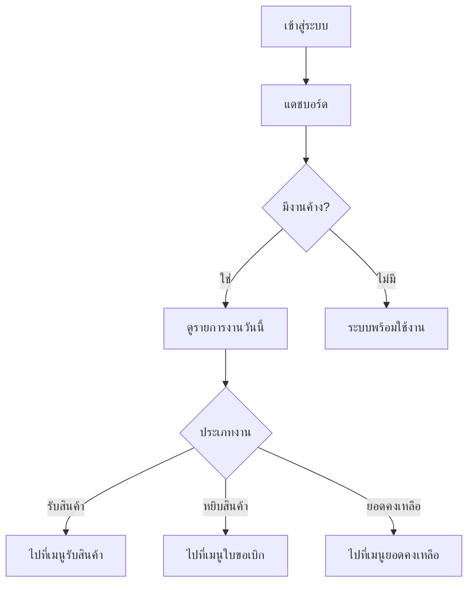

# แดชบอร์ดปฏิบัติการ (Operations Dashboard)

## วัตถุประสงค์
หน้าแดชบอร์ดแสดงภาพรวมของระบบคลังสินค้าแบบเรียลไทม์ ประกอบด้วยจำนวนสินค้า จำนวนสถานที่จัดเก็บ สถานะของงานที่ค้างอยู่ และแจ้งเตือนความผิดปกติของระบบ

## ผู้ใช้งาน
- ผู้จัดการคลังสินค้า (Warehouse Manager)
- ธุรการคลังสินค้า (Warehouse Admin)
- ผู้ดูแลระบบ (Admin)

## สิทธิ์ที่ต้องการ
- ระดับขั้นต่ำ: **Viewer** (ดูได้อย่างเดียว)
- แดชบอร์ดเต็มรูปแบบ: **Warehouse Admin** ขึ้นไป

## การเข้าถึง

| เมนู | เส้นทาง |
|------|---------|
| Main Operation | แดชบอร์ด |
| URL | `/dashboard` |

---

## คำอธิบายหน้าจอ

เมื่อเข้าสู่ระบบสำเร็จ ระบบจะนำท่านมาที่หน้าแดชบอร์ดโดยอัตโนมัติ

---

## ส่วนประกอบหลักของหน้าจอ

### 1. KPI การ์ด (ข้อมูลสรุปหลัก)

| การ์ด | ข้อมูลที่แสดง | สี |
|------|--------------|-----|
| จำนวนประเภทสินค้า | จำนวนสินค้าในระบบ | น้ำเงินเข้ม |
| สถานที่จัดเก็บ | จำนวน Location ในคลัง | ฟ้า |
| เอกสารรับเข้าที่เปิดอยู่ | จำนวนใบรับสินค้าที่ยังไม่เสร็จ | เหลือง |
| ยอดคงเหลือ | จำนวนรายการสต๊อกและจำนวนลูกค้า | เขียว |
| ปริมาณสต๊อกรวม | จำนวนรวมของสินค้าในคลัง | ฟ้า |
| การเคลื่อนไหว | จำนวนรายการเคลื่อนไหวสต๊อก | เขียว |

### 2. แผนผังสถานะระบบ (System Status Workflow)

แสดงขั้นตอนการทำงานในคลังสินค้าแบบเรียลไทม์:

```
รับสินค้า → Putaway → ยอดคงเหลือ → หยิบสินค้า → ส่งออก
```

| ขั้นตอน | ข้อมูลที่แสดง |
|---------|--------------|
| รับสินค้า (Receiving) | จำนวนเอกสารรับที่เปิดอยู่ |
| จัดเก็บ (Putaway) | จำนวนงาน Putaway ที่รอดำเนินการ |
| ยอดคงเหลือ (Stock Balance) | ปริมาณสต๊อกรวมในระบบ |
| หยิบสินค้า (Picking) | จำนวนคิวหยิบสินค้าที่ค้าง |
| ส่งออก (Dispatch) | จำนวนเอกสารส่งออกที่รอดำเนินการ |

### 3. รายการงานวันนี้ (Today's Task List)

แสดงงานที่ต้องดำเนินการในวันปัจจุบัน:
- เอกสารรับเข้าที่รอตรวจสอบ (X รายการ)
- งานจัดเก็บ Putaway ที่รอทำ (X รายการ)
- คิวหยิบสินค้าที่ค้างอยู่ (X รายการ)
- เอกสารส่งออกที่รอตรวจสอบ (X รายการ)

> หากไม่มีงานค้าง ระบบจะแสดง "ไม่มีงานค้างสำหรับวันนี้"

### 4. แจ้งเตือนระบบ (System Alerts)

| ข้อความแจ้งเตือน | ความหมาย | สี |
|-----------------|----------|-----|
| ยังไม่ได้ตั้งค่าผังคลังสินค้า | ยังไม่มี Location ในระบบ | เหลือง |
| ยังไม่ได้นำเข้าข้อมูลสินค้าพื้นฐาน | ยังไม่มีข้อมูลสินค้า | เหลือง |
| ยังไม่ได้เพิ่มข้อมูลลูกค้า | ยังไม่มีลูกค้าในระบบ | เหลือง |
| ยังไม่มีสต๊อกสินค้าในระบบ | ยังไม่มีการรับสินค้า | ฟ้า |
| ระบบพร้อมใช้งาน ข้อมูลพื้นฐานครบถ้วน | ทุกอย่างพร้อม | เขียว |

### 5. แผนผังคลังสินค้า (Warehouse Layout Map)

แสดงผังคลังสินค้าแบบภาพ แสดงสถานะการครอบครอง (Occupancy) ของแต่ละ Location

---

## ขั้นตอนการใช้งาน

### เข้าสู่หน้าแดชบอร์ด

**ขั้นตอนที่ 1:** เข้าสู่ระบบด้วยอีเมลและรหัสผ่าน
**ขั้นตอนที่ 2:** ระบบนำท่านมาที่หน้าแดชบอร์ดโดยอัตโนมัติ
**ขั้นตอนที่ 3:** ระบบโหลดข้อมูลจากฐานข้อมูลและแสดงผล (ระหว่างโหลด จะเห็น "..." แทนตัวเลข)
**ขั้นตอนที่ 4:** ตรวจสอบ KPI การ์ด รายการงาน และแจ้งเตือน

---

## ปุ่มและการดำเนินการ

| ปุ่ม/การดำเนินการ | คำอธิบาย |
|-----------------|---------|
| คลิกที่ Location ในผัง | ดูรายละเอียดสินค้าที่จัดเก็บใน Location นั้น |
| เมนูด้านซ้าย | เข้าถึงฟังก์ชันต่างๆ ของระบบ |

---

## สถานะที่แสดงในระบบ Workflow

| สถานะ | ความหมาย | สี |
|------|----------|-----|
| เปิดอยู่ (OPEN) | งานที่กำลังดำเนินการ | ฟ้า |
| ผ่าน (PASS) | งานเสร็จสมบูรณ์ | เขียว |
| ร่าง (DRAFT) | งานที่ยังไม่เริ่ม | เทา |
| ค้าง (HOLD) | งานที่ถูกหยุดพัก | แดง |

---

## แผนผัง Flowchart



---

## กฎทางธุรกิจ

1. ข้อมูลในแดชบอร์ดโหลดใหม่ทุกครั้งที่เข้าหน้านี้
2. หากระบบไม่สามารถเชื่อมต่อฐานข้อมูลได้ จะแสดงข้อความแจ้งเตือนสีแดง
3. ผู้ใช้ที่มีบทบาท Customer จะไม่เห็นหน้าแดชบอร์ดนี้ (จะเข้าสู่ Customer Portal แทน)

---

## คำถามที่พบบ่อย

**ถาม:** ทำไมตัวเลขใน KPI การ์ดแสดงเป็น "—"?
**ตอบ:** ระบบกำลังโหลดข้อมูล รอสักครู่ หรือตรวจสอบการเชื่อมต่ออินเทอร์เน็ต

**ถาม:** แผนผังคลังสินค้าไม่แสดงผล ต้องทำอย่างไร?
**ตอบ:** ต้องตั้งค่า Location ของคลังสินค้าในเมนู System Administration → Location คลังสินค้า ก่อน

**ถาม:** รายการงานวันนี้ว่างเปล่า หมายความว่าอะไร?
**ตอบ:** ไม่มีงานค้างในระบบ ถือว่าเป็นสถานการณ์ปกติ

---

## แนวปฏิบัติที่ดี

- ตรวจสอบแดชบอร์ดทุกเช้าก่อนเริ่มงาน
- ให้ความสนใจกับแจ้งเตือนสีเหลืองและสีแดง
- หากพบว่างานค้างมาก ให้มอบหมายงานให้ทีมงานดำเนินการทันที
