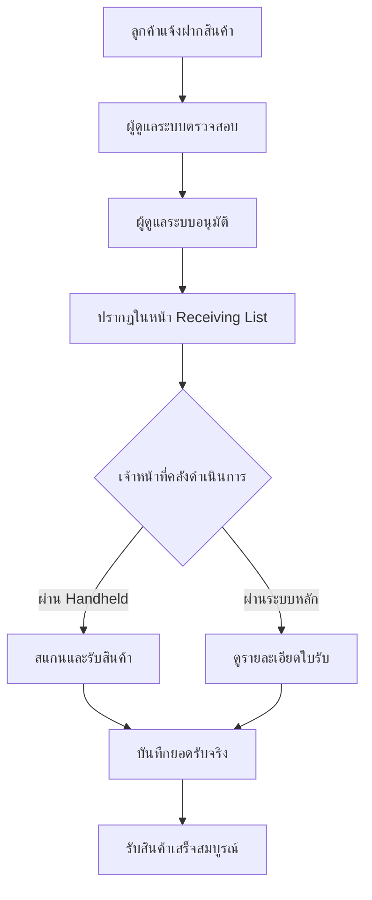

# รายการใบรับสินค้า (Receiving List)

## วัตถุประสงค์
หน้านี้แสดงรายการใบรับสินค้าทั้งหมดที่มาจากคำขอฝากสินค้าของลูกค้า เมื่อลูกค้าแจ้งฝากสินค้าและผู้ดูแลระบบอนุมัติแล้ว จะปรากฏเป็นการแจ้งเตือนในหน้านี้ให้เจ้าหน้าที่คลังดำเนินการรับสินค้าเข้าคลัง

## ผู้ใช้งาน
- ธุรการคลังสินค้า (Warehouse Admin)
- ผู้จัดการคลังสินค้า (Warehouse Manager)
- เจ้าหน้าที่คลังสินค้า (Warehouse Staff)

## สิทธิ์ที่ต้องการ
- **Warehouse Admin** ขึ้นไป

## การเข้าถึง

| เมนู | เส้นทาง |
|------|---------|
| Inbound Management | การรับเข้า |
| URL | `/operations/receiving` |

---

## คำอธิบายหน้าจอ

หน้านี้ประกอบด้วย 2 ส่วนหลัก:

### 1. ส่วนคำแนะนำ (Source Document Guidance)
กล่องสีเหลืองอธิบายว่าใบรับสินค้าในระบบ TGC WMS มาจากคำขอฝากสินค้าของลูกค้า ไม่ใช่การสร้างใบรับสินค้าโดยตรง

### 2. การแจ้งเตือนคำขอฝากสินค้า (Customer Deposit Notifications)

แสดงรายการคำขอฝากสินค้าจากลูกค้าที่อยู่ในสถานะรอรับเข้าคลัง โดยแสดงข้อมูล:

| คอลัมน์ | ความหมาย |
|---------|----------|
| เลขที่คำขอ (Request No) | รหัสเฉพาะของคำขอฝากสินค้า |
| ชื่อลูกค้า | ชื่อบริษัทหรือชื่อลูกค้า |
| สถานะ | สถานะปัจจุบันของคำขอ |
| วันที่คาดว่าจะมาถึง | วันที่ลูกค้าแจ้งว่าสินค้าจะมาถึง |
| ผู้ติดต่อ | ชื่อผู้ติดต่อที่นำสินค้ามาส่ง |
| เบอร์โทร | เบอร์โทรศัพท์ผู้ติดต่อ |

---

## สถานะของคำขอฝากสินค้าที่แสดงในหน้านี้

| สถานะ | ความหมาย | สี |
|------|----------|-----|
| ADMIN_ACCEPTED (ผู้ดูแลระบบอนุมัติแล้ว) | ผู้ดูแลระบบอนุมัติคำขอ รอคลังรับสินค้า | เขียว |
| WAREHOUSE_RECEIVING (กำลังรับเข้าคลัง) | เจ้าหน้าที่คลังกำลังดำเนินการรับสินค้า | ฟ้า |

---

## ขั้นตอนการใช้งาน

### ตรวจสอบคำขอฝากสินค้าที่รอรับเข้าคลัง

**ขั้นตอนที่ 1:** เข้าเมนู **Inbound Management → การรับเข้า**

**ขั้นตอนที่ 2:** ระบบแสดงรายการคำขอฝากสินค้าที่อยู่ในสถานะรอรับ

**ขั้นตอนที่ 3:** ตรวจสอบข้อมูลคำขอ:
- เลขที่คำขอ
- ชื่อลูกค้า
- วันที่คาดว่าจะมาถึง
- ข้อมูลผู้ติดต่อ

**ขั้นตอนที่ 4:** คลิกที่คำขอเพื่อดูรายละเอียด หรือมอบหมายให้เจ้าหน้าที่คลังดำเนินการรับสินค้าผ่านแอปพลิเคชันมือถือ (Handheld)

---

## กระบวนการรับสินค้าเข้าคลัง

---

## กฎทางธุรกิจ

1. ใบรับสินค้าในระบบ TGC WMS **ไม่ได้สร้างโดยตรง** แต่มาจากคำขอฝากสินค้าของลูกค้าที่ผ่านการอนุมัติแล้ว
2. หากต้องการรับสินค้าจริง ต้องดำเนินการผ่านแอป Handheld ที่หน้า `/handheld`
3. เจ้าหน้าที่คลังต้องมีสิทธิ์ `receiving` จึงจะสามารถยืนยันรับสินค้าได้

---

## คำถามที่พบบ่อย

**ถาม:** ไม่เห็นคำขอฝากสินค้าในหน้านี้ ทำไม?
**ตอบ:** ตรวจสอบว่าลูกค้าได้ส่งคำขอและผู้ดูแลระบบได้อนุมัติแล้วหรือยัง คำขอที่ยังเป็น DRAFT หรือ SUBMITTED จะไม่ปรากฏที่นี่

**ถาม:** จะรับสินค้าจริงได้อย่างไร?
**ตอบ:** ใช้แอป Handheld ที่เมนู Barcode/Handheld → ศูนย์สแกน แล้วเลือก "รับสินค้าเข้า"

---

## แนวปฏิบัติที่ดี

- ตรวจสอบหน้า Receiving List ทุกเช้าเพื่อเตรียมรับสินค้าในวันนั้น
- ประสานงานกับลูกค้าล่วงหน้าเพื่อยืนยันเวลาที่สินค้าจะมาถึง
- มอบหมายงานให้เจ้าหน้าที่คลังและแจ้งเลขที่คำขอที่ต้องดำเนินการ
