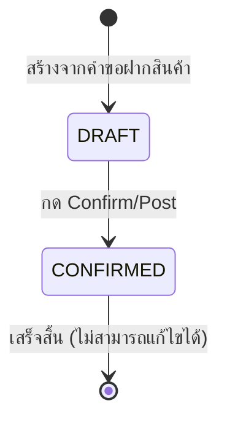

# รายละเอียดใบรับสินค้า (Receiving Detail)

## วัตถุประสงค์
หน้านี้แสดงรายละเอียดของใบรับสินค้าแต่ละใบ และให้ผู้มีสิทธิ์ยืนยัน/ผ่านรายการ (Confirm/Post) เพื่อบันทึกสต๊อกสินค้าเข้าระบบ เมื่อยืนยันแล้ว ระบบจะสร้างรายการเคลื่อนไหวสต๊อก (Stock Movement) โดยอัตโนมัติ

## ผู้ใช้งาน
- ธุรการคลังสินค้า (Warehouse Admin) — สามารถยืนยันรับได้
- ผู้จัดการคลังสินค้า (Warehouse Manager) — สามารถยืนยันรับได้
- เจ้าหน้าที่คลังสินค้า (Warehouse Staff) — ดูได้อย่างเดียว

## สิทธิ์ที่ต้องการ
- ดูข้อมูล: **Warehouse Staff** ขึ้นไป
- ยืนยันรับสินค้า (Confirm/Post): ต้องมีสิทธิ์ **Receiving Write**

## การเข้าถึง

| เมนู | เส้นทาง |
|------|---------|
| Inbound Management → การรับเข้า | คลิกเลขที่ใบรับ |
| URL | `/operations/receiving/:id` |

---

## คำอธิบายหน้าจอ

### ส่วนที่ 1: ปุ่มนำทาง
- **กลับไปรายการ (Back to receiving list):** ออกจากหน้านี้กลับไปยังรายการใบรับสินค้า
- **รีเฟรช (Refresh):** โหลดข้อมูลใหม่จากระบบ
- **พิมพ์/ส่งออก:** พิมพ์รายงานใบรับสินค้า

### ส่วนที่ 2: ข้อมูลเอกสาร (Document Header)

| ข้อมูล | ความหมาย |
|--------|---------|
| Document No (เลขที่เอกสาร) | รหัสเฉพาะของใบรับสินค้า |
| สถานะ (Status Badge) | DRAFT หรือ CONFIRMED |
| Customer (ลูกค้า) | รหัสหรือชื่อลูกค้า |
| Warehouse (คลังสินค้า) | คลังที่รับสินค้าเข้า |
| Type (ประเภท) | ประเภทการรับ |
| Reference (อ้างอิง) | เลขที่เอกสารต้นทาง |
| Created At (วันที่สร้าง) | วันที่และเวลาที่สร้างเอกสาร |

### ส่วนที่ 3: แผงยืนยัน/ผ่านรายการ (Confirm/Post Panel)

กล่องสีส้มแสดงสถานะการยืนยัน:

| สถานการณ์ | ข้อความที่แสดง |
|-----------|--------------|
| เอกสารเป็น DRAFT และมีสิทธิ์ | "เอกสารนี้เป็น DRAFT สามารถยืนยัน/ผ่านรายการได้" |
| เอกสารเป็น DRAFT แต่ไม่มีสิทธิ์ | "การยืนยัน/ผ่านรายการถูกจำกัด" |
| ยืนยันแล้ว (CONFIRMED) | "ยืนยัน/ผ่านรายการเรียบร้อยแล้ว แสดงได้เพียงอ่านอย่างเดียว" |
| สถานะอื่นๆ | "ไม่สามารถยืนยัน/ผ่านรายการสำหรับสถานะนี้" |

### ส่วนที่ 4: สรุปจำนวน (Quantity Summary)
แสดงจำนวนรายการในใบรับ (จำนวนบรรทัด)

### ส่วนที่ 5: รายการใบรับ (Receiving Lines)

| คอลัมน์ | ความหมาย |
|---------|---------|
| Product ID | รหัสสินค้า |
| Lot ID | รหัสล็อตสินค้า |
| Location ID | รหัสสถานที่จัดเก็บ |
| Quantity | จำนวน |
| Weight | น้ำหนัก (กก.) |
| Source Line ID | รหัสรายการต้นทาง |

### ส่วนที่ 6: รายการเคลื่อนไหวสต๊อก (Stock Movements)

แสดงเฉพาะเมื่อเอกสารอยู่ในสถานะ CONFIRMED

| คอลัมน์ | ความหมาย |
|---------|---------|
| Movement ID | รหัสการเคลื่อนไหว |
| Movement Type | ประเภทการเคลื่อนไหว |
| Quantity | จำนวน |
| Weight | น้ำหนัก |
| To Location ID | สถานที่ปลายทาง |
| Source Line ID | รหัสรายการต้นทาง |
| Created At | วันที่และเวลา |

---

## ขั้นตอนการยืนยันรับสินค้า (Confirm/Post)

**ขั้นตอนที่ 1:** เปิดใบรับสินค้าที่ต้องการยืนยัน (สถานะต้องเป็น DRAFT)

**ขั้นตอนที่ 2:** ตรวจสอบข้อมูลในใบรับให้ถูกต้อง:
- ชื่อลูกค้า ✓
- สถานที่คลัง ✓
- รายการสินค้าและจำนวน ✓

**ขั้นตอนที่ 3:** คลิกปุ่ม **"Confirm/Post Receiving"** (สีน้ำตาลส้ม)

**ขั้นตอนที่ 4:** รอระบบประมวลผล (ปุ่มจะเปลี่ยนเป็น "Posting receiving...")

**ขั้นตอนที่ 5:** เมื่อสำเร็จ ระบบจะแสดงข้อความ "Receiving document Confirm/Post completed." และเปลี่ยนสถานะเป็น **CONFIRMED**

**ขั้นตอนที่ 6:** ระบบสร้างรายการเคลื่อนไหวสต๊อกโดยอัตโนมัติ ตรวจสอบได้ที่ส่วน "Stock Movements"

---

## ปุ่มทั้งหมด

| ปุ่ม | สี | เงื่อนไข | คำอธิบาย |
|------|-----|---------|---------|
| กลับไปรายการ | ลิงก์ | เสมอ | กลับสู่รายการใบรับ |
| Refresh | เทาอ่อน | เสมอ | โหลดข้อมูลใหม่ |
| Print/Export | - | เสมอ | พิมพ์รายงานใบรับสินค้า |
| Confirm/Post Receiving | น้ำตาลส้ม | DRAFT + มีสิทธิ์ | ยืนยันรับสินค้าเข้าระบบ |

---

## สถานะของใบรับสินค้า

---

## กฎทางธุรกิจ

1. ใบรับสินค้าสถานะ **DRAFT** เท่านั้นที่สามารถยืนยัน (Confirm/Post) ได้
2. เมื่อยืนยันแล้ว เอกสารจะเป็น **CONFIRMED** และ **ไม่สามารถแก้ไขได้**
3. การยืนยันจะสร้างรายการ Stock Movement อัตโนมัติ ซึ่งอัปเดตยอดคงเหลือสต๊อก
4. เฉพาะผู้มีสิทธิ์ Receiving Write เท่านั้นที่กดปุ่มยืนยันได้ (Warehouse Admin ขึ้นไป)

---

## ข้อความแจ้งเตือน

| ข้อความ | ความหมาย | การดำเนินการ |
|---------|----------|------------|
| Unable to Confirm/Post receiving document | ยืนยันไม่สำเร็จ | ตรวจสอบสิทธิ์และสถานะเอกสาร |
| Receiving document Confirm/Post completed | ยืนยันสำเร็จ | ไม่ต้องดำเนินการใดเพิ่ม |

---

## คำถามที่พบบ่อย

**ถาม:** ปุ่ม Confirm/Post ไม่ปรากฏ ทำไม?
**ตอบ:** มี 2 สาเหตุ: (1) เอกสารไม่ได้อยู่ในสถานะ DRAFT หรือ (2) บัญชีผู้ใช้ไม่มีสิทธิ์ Receiving Write ติดต่อผู้ดูแลระบบ

**ถาม:** ยืนยันแล้วแต่ Stock Movement ไม่ขึ้น ต้องทำอย่างไร?
**ตอบ:** กดปุ่ม Refresh เพื่อโหลดข้อมูลใหม่ หากยังไม่แสดง ติดต่อผู้ดูแลระบบ

**ถาม:** ยืนยันผิด ต้องยกเลิกได้ไหม?
**ตอบ:** เมื่อยืนยัน (CONFIRMED) แล้ว ไม่สามารถยกเลิกหรือแก้ไขได้ ต้องสร้างรายการปรับปรุง (Adjustment) แทน

---

## แนวปฏิบัติที่ดี

- ตรวจสอบรายการสินค้าและจำนวนให้ตรงกับสินค้าจริงก่อนกด Confirm/Post
- พิมพ์รายงานใบรับสินค้าเก็บไว้เป็นหลักฐาน
- แจ้งลูกค้าทันทีหลังยืนยันรับสินค้าเสร็จสิ้น
