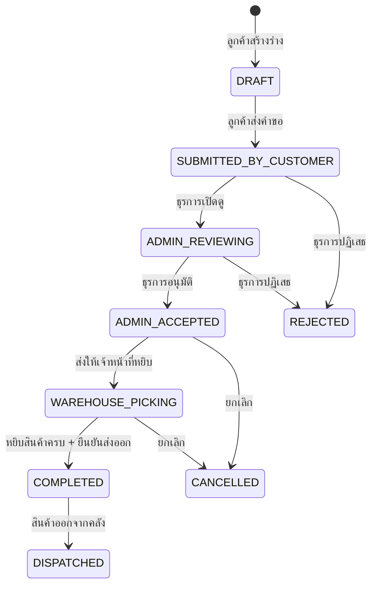

# ตรวจสอบใบขอเบิกสินค้า (Withdrawal Review)

## วัตถุประสงค์
หน้านี้ให้ธุรการคลังและผู้จัดการคลังตรวจสอบและดำเนินการกับคำขอเบิกสินค้าจากลูกค้า ตั้งแต่การเปิดใบงาน อนุมัติ ส่งงานให้เจ้าหน้าที่หยิบสินค้า ไปจนถึงยืนยันการส่งออก

## ผู้ใช้งาน
- ธุรการคลังสินค้า (Warehouse Admin)
- ผู้จัดการคลังสินค้า (Warehouse Manager)
- ผู้ดูแลระบบ (Admin)

## สิทธิ์ที่ต้องการ
- **Warehouse Admin** ขึ้นไป
- การอนุมัติ/ปฏิเสธ: ต้องมีสิทธิ์ **Withdrawal Write**

## การเข้าถึง

| เมนู | เส้นทาง |
|------|---------|
| Outbound Management | ใบขอเบิก |
| URL | `/customer/admin/withdrawal-review` |

---

## คำอธิบายหน้าจอ

### ส่วนที่ 1: รายการคำขอเบิกสินค้า

แสดงรายการคำขอเบิกสินค้าทั้งหมด พร้อมช่องค้นหา

**ช่องค้นหา:** พิมพ์เลขที่ใบขอเบิก, ชื่อลูกค้า, สถานะ, ประเภทการส่ง, ผู้ติดต่อ หรือปลายทาง

**คอลัมน์ที่แสดง:**

| คอลัมน์ | ความหมาย |
|---------|---------|
| เลขที่ใบขอเบิก (Withdrawal No) | รหัสเฉพาะของคำขอเบิก |
| ชื่อลูกค้า | บริษัทหรือชื่อลูกค้า |
| สถานะ | สถานะปัจจุบัน |
| ประเภทการส่ง (Delivery Type) | PICKUP (รับเอง) หรือ DELIVERY (ส่งถึงที่) |
| ผู้ติดต่อรับสินค้า | ชื่อผู้มารับหรือรับสินค้า |
| ปลายทาง | ที่อยู่ปลายทาง |
| วันที่ขอส่ง | วันที่ต้องการให้สินค้าออกจากคลัง |

**คลิกที่แถวใด** เพื่อดูรายละเอียดในแผงด้านขวา

### ส่วนที่ 2: รายละเอียดคำขอ (Detail Panel)

เมื่อเลือกคำขอใด รายละเอียดจะแสดงทางด้านขวา:

| ข้อมูล | ความหมาย |
|--------|---------|
| เลขที่ใบขอเบิก | รหัสเฉพาะ |
| สถานะ | Badge สีตามสถานะ |
| ลูกค้า | ชื่อและรหัสลูกค้า |
| ประเภทการส่ง | PICKUP / DELIVERY |
| วันที่ขอส่ง | วันที่ต้องการ |
| ผู้ติดต่อ | ชื่อและเบอร์โทร |
| ปลายทาง | ที่อยู่ส่ง |
| หมายเหตุ | ข้อความเพิ่มเติม |

**รายการสินค้า (Lines):**

| คอลัมน์ | ความหมาย |
|---------|---------|
| ชื่อสินค้า | สินค้าที่ขอเบิก |
| รหัสสินค้า | รหัสประจำสินค้า |
| จำนวนที่ขอ | จำนวนกล่องที่ต้องการ |
| น้ำหนักที่ขอ | น้ำหนักที่ต้องการ |
| LOT No | หมายเลข LOT |
| สถานะการหยิบ | รอดำเนินการ / จัดแล้ว |

---

## ขั้นตอนการดำเนินการ

### กรณีที่ 1: เปิดใบงานและส่งให้หยิบสินค้า (วิธีปกติ)

**ขั้นตอนที่ 1:** เลือกคำขอที่มีสถานะ **SUBMITTED_BY_CUSTOMER** หรือ **ADMIN_REVIEWING**

**ขั้นตอนที่ 2:** ตรวจสอบรายการสินค้า จำนวน วันที่ และข้อมูลปลายทาง

**ขั้นตอนที่ 3:** พิมพ์หมายเหตุหรือความคิดเห็น (ไม่บังคับ) ในช่อง Comment

**ขั้นตอนที่ 4:** คลิกปุ่ม **"เปิดใบงาน (Open Work Order)"**

ระบบจะดำเนินการ 3 ขั้นตอนอัตโนมัติ:
1. เปลี่ยนสถานะเป็น ADMIN_REVIEWING
2. อนุมัติ (ADMIN_ACCEPTED)
3. ส่งให้เจ้าหน้าที่หยิบสินค้า (WAREHOUSE_PICKING)

**ขั้นตอนที่ 5:** รอข้อความยืนยัน "เปิดใบงานเรียบร้อย — ส่งให้เจ้าหน้าที่แล้ว"

### กรณีที่ 2: ยืนยันการส่งออก (เมื่อหยิบสินค้าครบแล้ว)

**ขั้นตอนที่ 1:** เลือกคำขอที่มีสถานะ **WAREHOUSE_PICKING**

**ขั้นตอนที่ 2:** ตรวจสอบว่ารายการสินค้าทุกรายการมีสถานะ "จัดแล้ว" ครบ

**ขั้นตอนที่ 3:** คลิกปุ่ม **"ยืนยันส่งออก (Confirm Dispatch)"**

**ขั้นตอนที่ 4:** สถานะเปลี่ยนเป็น **COMPLETED** หรือ **DISPATCHED**

### กรณีที่ 3: ปฏิเสธคำขอ (Reject)

**ขั้นตอนที่ 1:** เลือกคำขอที่ต้องการปฏิเสธ

**ขั้นตอนที่ 2:** คลิกปุ่ม **"ปฏิเสธ (Reject)"**

**ขั้นตอนที่ 3:** กรอกเหตุผลการปฏิเสธในช่องที่ปรากฏ (บังคับ)

**ขั้นตอนที่ 4:** คลิก **"ยืนยันการปฏิเสธ"**

### กรณีที่ 4: ยกเลิกคำขอ (Cancel)

**ขั้นตอนที่ 1:** เลือกคำขอที่ต้องการยกเลิก

**ขั้นตอนที่ 2:** คลิกปุ่ม **"ยกเลิก (Cancel)"**

**ขั้นตอนที่ 3:** กรอกเหตุผลการยกเลิก (บังคับ)

**ขั้นตอนที่ 4:** คลิก **"ยืนยันการยกเลิก"**

---

## ปุ่มทั้งหมดและเงื่อนไข

| ปุ่ม | เงื่อนไขที่ปรากฏ | คำอธิบาย |
|------|---------------|---------|
| เปิดใบงาน (Open Work Order) | สถานะ SUBMITTED หรือ ADMIN_REVIEWING | อนุมัติและส่งให้เจ้าหน้าที่หยิบสินค้า |
| ส่งให้ Handheld | สถานะ ADMIN_ACCEPTED | ส่งงานให้เจ้าหน้าที่คลังผ่าน Handheld |
| ยืนยันส่งออก (Confirm Dispatch) | สถานะ WAREHOUSE_PICKING | ยืนยันการส่งสินค้าออก |
| ปฏิเสธ (Reject) | ไม่ใช่ REJECTED, COMPLETED, DISPATCHED, CANCELLED | ปฏิเสธคำขอพร้อมเหตุผล |
| ยกเลิก (Cancel) | ไม่ใช่ COMPLETED, DISPATCHED, CANCELLED, REJECTED | ยกเลิกคำขอพร้อมเหตุผล |
| แจ้งเตือนลูกค้า (Notify) | ทุกสถานะ | ส่งการแจ้งเตือนให้ลูกค้า |
| พิมพ์ (Print) | เสมอ | พิมพ์เอกสารคำขอเบิก |

---

## สถานะและการไหลของงาน

| สถานะ | ความหมาย | สี |
|------|----------|-----|
| DRAFT (ร่าง) | ลูกค้ากำลังสร้างคำขอ | เทา |
| SUBMITTED_BY_CUSTOMER (ส่งแล้ว) | ลูกค้าส่งคำขอรอตรวจสอบ | ฟ้า |
| ADMIN_REVIEWING (กำลังตรวจสอบ) | ธุรการกำลังดำเนินการ | เหลือง |
| ADMIN_ACCEPTED (อนุมัติแล้ว) | ธุรการอนุมัติ รอหยิบสินค้า | เขียวอ่อน |
| WAREHOUSE_PICKING (กำลังจัดสินค้า) | เจ้าหน้าที่กำลังหยิบสินค้า | ฟ้าเข้ม |
| COMPLETED (เสร็จสิ้น) | สินค้าออกจากคลังแล้ว | เขียวเข้ม |
| DISPATCHED (ส่งออกแล้ว) | สินค้าถูกส่งออก | เขียว |
| REJECTED (ถูกปฏิเสธ) | คำขอถูกปฏิเสธ | แดง |
| CANCELLED (ยกเลิก) | คำขอถูกยกเลิก | เทาเข้ม |

---

## กฎทางธุรกิจ

1. เมื่อกดปุ่ม "เปิดใบงาน" ระบบจะทำ 3 ขั้นตอนอัตโนมัติในครั้งเดียว (REVIEWING → ACCEPTED → WAREHOUSE_PICKING)
2. ไม่สามารถยกเลิกหรือปฏิเสธคำขอที่เป็น COMPLETED, DISPATCHED หรือ CANCELLED แล้ว
3. การหยิบสินค้าจริงทำผ่านแอป Handheld โดยเจ้าหน้าที่คลัง
4. สถานะ WAREHOUSE_PICKING หมายความว่าเจ้าหน้าที่กำลังหยิบสินค้าอยู่

---

## คำถามที่พบบ่อย

**ถาม:** ปุ่ม "เปิดใบงาน" ไม่ปรากฏ ทำไม?
**ตอบ:** ตรวจสอบว่าสถานะคำขอเป็น SUBMITTED_BY_CUSTOMER หรือ ADMIN_REVIEWING ปุ่มจะปรากฏเฉพาะสถานะเหล่านี้

**ถาม:** สถานะค้างอยู่ที่ WAREHOUSE_PICKING นานมาก ต้องทำอย่างไร?
**ตอบ:** ติดต่อเจ้าหน้าที่คลังให้ดำเนินการหยิบสินค้าผ่านแอป Handheld และกด "ปิดใบงาน" หลังหยิบครบ

**ถาม:** จะส่งการแจ้งเตือนให้ลูกค้าได้อย่างไร?
**ตอบ:** กดปุ่ม "แจ้งเตือนลูกค้า (Notify)" และระบุข้อความที่ต้องการส่ง

---

## แนวปฏิบัติที่ดี

- ตรวจสอบคำขอเบิกทุกวันทำการ
- ดำเนินการอนุมัติโดยเร็วเพื่อไม่ให้ลูกค้ารอนาน
- กรอกเหตุผลที่ชัดเจนเมื่อปฏิเสธ เพื่อให้ลูกค้าปรับแก้และส่งคำขอใหม่ได้
- พิมพ์ใบงานเบิกส่งให้เจ้าหน้าที่คลังก่อนเริ่มหยิบสินค้า
