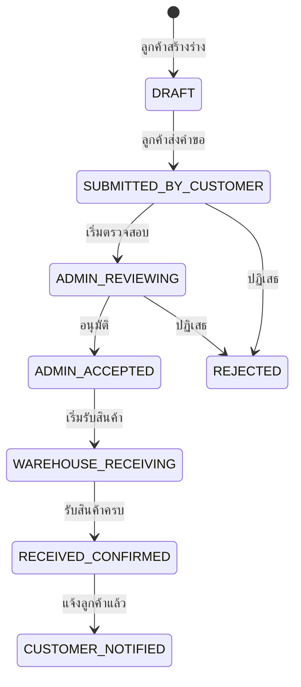

# ตรวจสอบคำขอฝากสินค้า (Deposit Review)

## วัตถุประสงค์
หน้านี้ให้ธุรการคลังตรวจสอบ อนุมัติ หรือปฏิเสธคำขอฝากสินค้าที่ลูกค้าส่งมา และบันทึกยอดรับจริงหลังจากสินค้ามาถึงคลัง

## ผู้ใช้งาน
- ธุรการคลังสินค้า (Warehouse Admin)
- ผู้จัดการคลังสินค้า (Warehouse Manager)
- ผู้ดูแลระบบ (Admin)

## สิทธิ์ที่ต้องการ
- **Warehouse Admin** ขึ้นไป

## การเข้าถึง

| เมนู | เส้นทาง |
|------|---------|
| Customer Portal → ภาพรวมพอร์ทัล | (เมนูผู้ดูแลระบบ) |
| URL | `/customer/admin/deposit-review` |

---

## คำอธิบายหน้าจอ

### ส่วนที่ 1: รายการคำขอฝากสินค้า

แสดงคำขอทั้งหมดที่ลูกค้าส่งมา

| คอลัมน์ | ความหมาย |
|---------|---------|
| เลขที่คำขอ | รหัสเฉพาะของคำขอฝาก |
| ชื่อลูกค้า | บริษัทหรือชื่อลูกค้า |
| สถานะ | สถานะปัจจุบัน |
| วันที่คาดว่าสินค้าจะมาถึง | วันที่ลูกค้าแจ้ง |
| ผู้ติดต่อ | ชื่อผู้นำสินค้ามาส่ง |
| เบอร์โทร | เบอร์ผู้ติดต่อ |
| ทะเบียนรถ | ทะเบียนยานพาหนะ |
| หมายเหตุ | ข้อมูลเพิ่มเติม |

### ส่วนที่ 2: รายการสินค้าในคำขอ

เมื่อเลือกคำขอ จะแสดงรายการสินค้า:

| คอลัมน์ | ความหมาย |
|---------|---------|
| ชื่อสินค้า | ชื่อสินค้าที่ต้องการฝาก |
| รหัสสินค้า | รหัสประจำสินค้าของลูกค้า |
| จำนวนกล่องที่แจ้ง | จำนวนที่ลูกค้าแจ้งไว้ล่วงหน้า |
| น้ำหนักที่แจ้ง | น้ำหนักที่ลูกค้าแจ้งไว้ |
| เลข LOT | หมายเลข LOT (ถ้ามี) |
| วันผลิต | วันที่ผลิต (ถ้ามี) |
| วันหมดอายุ | วันหมดอายุ (ถ้ามี) |
| จำนวนที่รับจริง | กรอกหลังรับสินค้าจริง |
| น้ำหนักที่รับจริง | กรอกหลังรับสินค้าจริง |

---

## ขั้นตอนการดำเนินการ

### ขั้นตอนที่ 1: ตรวจสอบและอนุมัติ (ก่อนสินค้ามาถึง)

**1.** เลือกคำขอที่มีสถานะ **SUBMITTED_BY_CUSTOMER**

**2.** ตรวจสอบรายการสินค้า วันที่ และข้อมูลลูกค้า

**3.** คลิกปุ่ม **"อนุมัติ (Approve)"** หรือ **"ปฏิเสธ (Reject)"**

- หากอนุมัติ: สถานะเปลี่ยนเป็น **ADMIN_ACCEPTED**
- หากปฏิเสธ: กรอกเหตุผล แล้วสถานะเปลี่ยนเป็น **REJECTED**

### ขั้นตอนที่ 2: บันทึกยอดรับจริง (เมื่อสินค้ามาถึงคลัง)

วิธีที่ 1 — ผ่านแอป Handheld (แนะนำ):
- เจ้าหน้าที่คลังใช้แอป Handheld สแกนสินค้าและกรอกจำนวนจริง

วิธีที่ 2 — ผ่านระบบหลัก:
- เลือกคำขอที่มีสถานะ **ADMIN_ACCEPTED** หรือ **WAREHOUSE_RECEIVING**
- กรอกจำนวนจริงและน้ำหนักจริงในตาราง
- คลิก **"บันทึก"**

---

## สถานะของคำขอฝากสินค้า

| สถานะ | ความหมาย |
|------|----------|
| DRAFT | ลูกค้ากำลังสร้าง ยังไม่ส่ง |
| SUBMITTED_BY_CUSTOMER | ลูกค้าส่งคำขอ รอตรวจสอบ |
| ADMIN_REVIEWING | ธุรการกำลังตรวจสอบ |
| ADMIN_ACCEPTED | อนุมัติแล้ว รอสินค้ามาถึง |
| WAREHOUSE_RECEIVING | กำลังรับสินค้าเข้าคลัง |
| RECEIVED_CONFIRMED | รับสินค้าเสร็จสมบูรณ์ |
| CUSTOMER_NOTIFIED | แจ้งลูกค้าแล้ว |
| REJECTED | ปฏิเสธ |

---

## กฎทางธุรกิจ

1. ต้องตรวจสอบและอนุมัติก่อนสินค้ามาถึง เพื่อให้เจ้าหน้าที่คลังทราบล่วงหน้า
2. หากจำนวนที่รับจริงต่างจากที่แจ้ง ระบบจะแสดงคำเตือน (Count Variance)
3. ควรบันทึก LOT Number, วันผลิต, และวันหมดอายุ เพื่อใช้ในรายงาน Storage Aging

---

## คำถามที่พบบ่อย

**ถาม:** ลูกค้าแจ้งจำนวนผิด ทำได้อย่างไร?
**ตอบ:** บันทึกยอดรับจริง (Actual) ตามที่นับได้จริง ระบบจะบันทึกทั้งยอดที่แจ้งและยอดจริงแยกกัน

**ถาม:** จะแจ้งลูกค้าว่ารับสินค้าเสร็จแล้วได้อย่างไร?
**ตอบ:** ใช้ปุ่ม "แจ้งเตือนลูกค้า" เพื่อส่งการแจ้งเตือนผ่านระบบ

---

## แนวปฏิบัติที่ดี

- อนุมัติคำขอภายใน 1 วันทำการหลังได้รับ
- ตรวจสอบความถูกต้องของ LOT Number และวันหมดอายุเสมอ
- แจ้งลูกค้าทันทีเมื่อรับสินค้าเสร็จ
