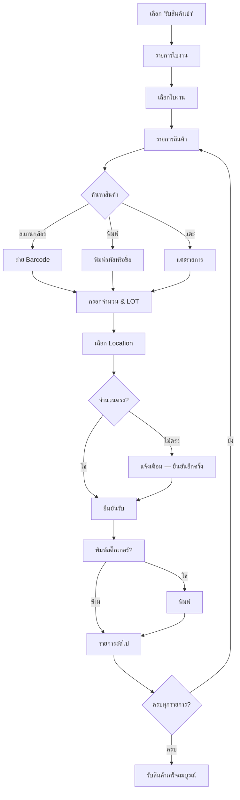

# รับสินค้าเข้าคลัง — Handheld (Handheld Receiving)

## วัตถุประสงค์
ฟังก์ชัน "รับสินค้าเข้า" บนอุปกรณ์ Handheld ให้เจ้าหน้าที่คลังสแกนและบันทึกสินค้าที่ได้รับจากลูกค้า พร้อมระบุตำแหน่งจัดเก็บ (Location), เลข LOT, วันผลิต และวันหมดอายุ สำหรับแต่ละรายการสินค้า

## ผู้ใช้งาน
- เจ้าหน้าที่คลังสินค้า (Warehouse Staff)
- ธุรการคลังสินค้า (Warehouse Admin)

## สิทธิ์ที่ต้องการ
- **Warehouse Staff** ขึ้นไป
- ต้องเข้าสู่ระบบ Handheld ก่อน

## การเข้าถึง

| เมนู | เส้นทาง |
|------|---------|
| หน้าหลัก Handheld | เลือก "รับสินค้าเข้า" |
| URL | `/handheld` → รับสินค้าเข้า |

**เงื่อนไขก่อนเข้าใช้งาน:**
- ต้องมีคำขอฝากสินค้าที่อนุมัติแล้ว (สถานะ ADMIN_ACCEPTED หรือ WAREHOUSE_RECEIVING)
- ต้องมีการตั้งค่า Location ในระบบ

---

## หน้าจอ: รายการใบงาน (Document List)

เมื่อเข้าสู่โหมดรับสินค้าเข้า จะเห็นรายการคำขอฝากสินค้าที่รอรับ:

| ข้อมูล | คำอธิบาย |
|--------|---------|
| เลขที่คำขอ (Request No) | รหัสประจำคำขอฝาก |
| สถานะ (Badge) | สีของสถานะปัจจุบัน |
| วันที่คาดว่าจะมาถึง | วันที่ลูกค้าแจ้ง |
| ชื่อลูกค้า/ผู้ติดต่อ | ชื่อผู้นำสินค้ามาส่ง |

> หากไม่มีใบงาน จะแสดง "ไม่มีใบงานที่รอรับสินค้า"

---

## หน้าจอ: รายละเอียดใบงาน (Work Order Detail)

หลังเลือกใบงาน จะเห็น:

**แถบความคืบหน้า:** แสดง X/Y รายการที่รับแล้ว (เส้นสีเขียว)

**รายการสินค้าในใบงาน:**

| ส่วนประกอบ | คำอธิบาย |
|-----------|---------|
| เลขลำดับ หรือ ✓ | ลำดับรายการ (✓ = รับแล้ว) |
| ชื่อสินค้า | ชื่อสินค้าหรือรหัสสินค้า |
| จำนวนกล่องที่แจ้ง | จำนวนที่ลูกค้าแจ้งไว้ |
| น้ำหนักที่แจ้ง | น้ำหนักที่ลูกค้าแจ้ง |
| สถานะ "รับแล้ว X กล่อง" | แสดงเมื่อรับสำเร็จ |

**การจัดเรียงรายการ (ตัวเลือก):**
- **ยังไม่ทำก่อน** — แสดงรายการที่ยังไม่รับขึ้นก่อน
- **ชื่อสินค้า (ก-ฮ)** — เรียงตามชื่อสินค้า
- **รหัสสินค้า (A-Z)** — เรียงตามรหัส

---

## ขั้นตอนการรับสินค้า

### ขั้นตอนที่ 1: เลือกใบงาน

แตะที่ใบงานที่ต้องการดำเนินการ ระบบจะโหลดรายการสินค้า

### ขั้นตอนที่ 2: ค้นหาหรือสแกนสินค้า

**วิธีที่ 1 — พิมพ์ค้นหา:**
- แตะช่องค้นหาที่แถบด้านล่าง
- พิมพ์รหัสสินค้า, ชื่อสินค้า, หรือเลข LOT
- รายการที่ตรงกันจะถูกเลือกอัตโนมัติ

**วิธีที่ 2 — สแกนกล้อง:**
- กดปุ่ม **"กล้อง"** สีเข้ม
- ถ่ายรูป Barcode ของสินค้า
- ระบบแสดง Barcode จากภาพ หากพบจะเลือกสินค้าให้อัตโนมัติ

**วิธีที่ 3 — แตะที่รายการ:**
- แตะที่รายการสินค้าในรายการโดยตรง

### ขั้นตอนที่ 3: กรอกข้อมูลสินค้า

เมื่อเลือกสินค้าแล้ว แผงด้านล่างจะแสดงฟอร์มกรอกข้อมูล:

| ฟิลด์ | บังคับ | คำอธิบาย |
|-------|--------|---------|
| เลข LOT | ไม่ | หมายเลข LOT ของสินค้า |
| วันผลิต | ไม่ | วันที่ผลิตสินค้า (ปฏิทิน) |
| วันหมดอายุ | ไม่ | วันหมดอายุสินค้า (ปฏิทิน) |
| กล่อง | ใช่* | จำนวนกล่องที่รับจริง |
| น้ำหนัก (กก.) | ใช่* | น้ำหนักที่ชั่งได้จริง |

(*ต้องกรอกอย่างน้อยหนึ่งอย่าง)

### ขั้นตอนที่ 4: เลือก Location จัดเก็บ

หากมีการตั้งค่า Location ในระบบ:

**แบบ Hierarchy (โซน-ฝั่ง-แถว-ชั้น):**
- เลือก **ห้อง/โซน** (Zone)
- เลือก **ฝั่ง** (L=ซ้าย, R=ขวา)
- เลือก **แถว** (Row)
- เลือก **ชั้น** (Level)

ระบบจะแสดง Location Code ที่เลือก เช่น H1-L-01-02

**แบบรายการ (ถ้าไม่มีโครงสร้าง):**
- เลือก Location จากปุ่มที่แสดงทั้งหมด

### ขั้นตอนที่ 5: ยืนยันรับสินค้า

กดปุ่ม **"✓ ยืนยันรับสินค้า"** (สีเขียว)

**กรณีพิเศษ — จำนวนไม่ตรง:**
หากกล่องหรือน้ำหนักต่างจากที่ลูกค้าแจ้ง ระบบจะแสดงคำเตือน:
> "⚠ จำนวนไม่ตรงกับที่แจ้ง"
> ที่แจ้ง: X กล่อง / Y กก. — ที่นับได้: A กล่อง / B กก.

กดยืนยันอีกครั้งเพื่อบันทึกตามยอดจริง

### ขั้นตอนที่ 6: พิมพ์สติ๊กเกอร์ (ไม่บังคับ)

หลังยืนยัน ระบบจะถามว่าต้องการพิมพ์สติ๊กเกอร์หรือไม่:

**สติ๊กเกอร์แสดงข้อมูล:**
- ชื่อลูกค้า
- ชื่อสินค้า
- เลข LOT
- วันผลิต / วันหมดอายุ
- รหัส Location จัดเก็บ
- QR Code

กดปุ่ม **"พิมพ์สติ๊กเกอร์"** หรือ **"ข้าม"** หากไม่ต้องการ

### ขั้นตอนที่ 7: รับสินค้ารายการถัดไป

ระบบกลับสู่หน้ารายการสินค้า รายการที่รับแล้วจะมีเครื่องหมาย ✓ สีเขียว
ทำซ้ำขั้นตอนที่ 2-6 จนกว่าจะรับสินค้าครบทุกรายการ

---

## เพิ่มสินค้าที่ไม่ได้แจ้งล่วงหน้า

หากมีสินค้าที่ลูกค้านำมาส่งแต่ไม่ได้แจ้งในคำขอ:

**ขั้นตอนที่ 1:** กดปุ่ม **"+ เพิ่มสินค้าที่ไม่ได้แจ้ง / เพิ่ม LOT ใหม่"**

**ขั้นตอนที่ 2:** กรอกข้อมูลสินค้าในฟอร์มที่ปรากฏ:

| ฟิลด์ | บังคับ |
|-------|--------|
| ชื่อสินค้า | ใช่ |
| รหัสสินค้าลูกค้า | ไม่ |
| เลข LOT | ไม่ |
| วันผลิต | ไม่ |
| วันหมดอายุ | ไม่ |
| จำนวนกล่อง | ใช่ |
| น้ำหนัก (กก.) | ไม่ |

**ขั้นตอนที่ 3:** กดปุ่ม **"✓ เพิ่มและบันทึก"**

---

## ปุ่มทั้งหมด

| ปุ่ม | ที่ปรากฏ | คำอธิบาย |
|------|---------|---------|
| ← (ย้อนกลับ) | ทุกหน้า | กลับไปหน้าก่อนหน้า |
| กล้อง | แถบค้นหา | เปิดกล้องสแกน Barcode |
| ✓ ยืนยันรับสินค้า | ฟอร์มกรอกข้อมูล | บันทึกยอดรับสินค้า |
| ✎ แก้ไขยอดรับเข้า | รายการที่รับแล้ว | แก้ไขยอดที่บันทึกไปแล้ว |
| ⚠ ยืนยันอีกครั้ง | แจ้งเตือนจำนวนไม่ตรง | ยืนยันว่าจำนวนต่างจริง |
| พิมพ์สติ๊กเกอร์ | หลังยืนยัน | พิมพ์ Label ติดสินค้า |
| ข้าม | หลังยืนยัน | ข้ามการพิมพ์สติ๊กเกอร์ |
| ✕ (ปิด) | ฟอร์มกรอกข้อมูล | ยกเลิกรายการปัจจุบัน |
| + เพิ่มสินค้าที่ไม่ได้แจ้ง | แถบด้านล่าง | เพิ่มสินค้านอกรายการ |

---

## เสียงและการสั่นสะเทือน

ระบบมีสัญญาณเสียงและการสั่นเมื่อสำเร็จ:
- เสียงสูงขึ้น (800Hz → 1200Hz)
- สั่น 3 ครั้ง

---

## กระบวนการทำงาน

---

## กฎทางธุรกิจ

1. ต้องมีคำขอฝากสินค้าที่อนุมัติแล้วก่อนจึงจะรับสินค้าได้
2. ยอดที่บันทึกเป็นยอด **ที่รับจริง** (Actual) ซึ่งอาจต่างจากที่ลูกค้าแจ้งได้
3. การบันทึก LOT Number และวันหมดอายุมีความสำคัญมากสำหรับระบบ Storage Aging
4. สามารถแก้ไขยอดที่บันทึกไปแล้วได้โดยแตะที่รายการอีกครั้ง

---

## คำถามที่พบบ่อย

**ถาม:** ไม่พบ Barcode ในภาพ ทำอย่างไร?
**ตอบ:** ถ่ายใหม่ให้ชัดขึ้น หรือพิมพ์รหัสสินค้าด้วยตนเอง

**ถาม:** Location ที่ต้องการไม่ปรากฏ ทำอย่างไร?
**ตอบ:** ติดต่อผู้ดูแลระบบให้เพิ่ม Location ในหน้า Warehouse Location Setup

**ถาม:** กรอกจำนวนผิด ยืนยันไปแล้ว แก้ได้ไหม?
**ตอบ:** ได้ แตะที่รายการนั้นอีกครั้ง จะเปิดฟอร์มให้แก้ไขและกด "✎ แก้ไขยอดรับเข้า"

---

## แนวปฏิบัติที่ดี

- กรอก LOT Number, วันผลิต และวันหมดอายุทุกครั้งที่มีข้อมูล
- เลือก Location ที่ถูกต้องตามแผนจัดเก็บ
- พิมพ์สติ๊กเกอร์และติดที่สินค้าทันทีหลังรับ
- ตรวจนับสินค้าจริงก่อนกรอกจำนวน ไม่ใช่ใช้ยอดที่ลูกค้าแจ้ง
