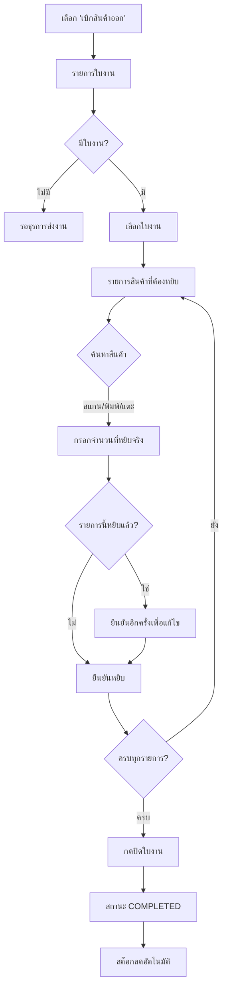

# หยิบสินค้าออกจากคลัง — Handheld (Handheld Picking)

## วัตถุประสงค์
ฟังก์ชัน "เบิกสินค้าออก" บนอุปกรณ์ Handheld ให้เจ้าหน้าที่คลังหยิบสินค้าตามคำขอเบิกของลูกค้า บันทึกจำนวนที่หยิบจริง และปิดใบงานเมื่อหยิบครบ

## ผู้ใช้งาน
- เจ้าหน้าที่คลังสินค้า (Warehouse Staff)
- ธุรการคลังสินค้า (Warehouse Admin)

## สิทธิ์ที่ต้องการ
- **Warehouse Staff** ขึ้นไป
- ต้องเข้าสู่ระบบ Handheld ก่อน
- ต้องมีคำขอเบิกที่ได้รับอนุมัติและส่งมาให้หยิบแล้ว

## การเข้าถึง

| เมนู | เส้นทาง |
|------|---------|
| หน้าหลัก Handheld | เลือก "เบิกสินค้าออก" |
| URL | `/handheld` → เบิกสินค้าออก |

**เงื่อนไขก่อนเข้าใช้งาน:**
- ต้องมีคำขอเบิกสินค้าสถานะ **ADMIN_ACCEPTED** หรือ **WAREHOUSE_PICKING**
- ธุรการต้องกด "เปิดใบงาน" ก่อนแล้ว

---

## หน้าจอ: รายการใบงาน

แสดงคำขอเบิกสินค้าที่รอหยิบ:

| ข้อมูล | คำอธิบาย |
|--------|---------|
| เลขที่ใบขอเบิก (Withdrawal No) | รหัสประจำคำขอ |
| สถานะ (Badge) | สีตามสถานะ |
| วันที่ขอส่ง | วันที่ลูกค้าต้องการสินค้า |
| ประเภทการส่ง | PICKUP / DELIVERY |

> หากไม่มีใบงาน จะแสดง "ไม่มีใบงานที่รอหยิบสินค้า"

---

## หน้าจอ: รายละเอียดใบงาน

หลังเลือกใบงาน:

**แถบความคืบหน้า:** X/Y รายการที่หยิบแล้ว (สีเขียว = ครบ, สีเข้ม = ยังไม่ครบ)

**รายการสินค้า:**

| ส่วนประกอบ | คำอธิบาย |
|-----------|---------|
| เลขลำดับ / ✓ | ลำดับ (✓ สีเขียว = หยิบแล้ว) |
| ชื่อสินค้า | ชื่อสินค้าที่ต้องหยิบ |
| จำนวนที่ขอ | กล่อง / กก. ที่ลูกค้าขอ |
| "จัดแล้ว X กล่อง" | แสดงเมื่อหยิบสำเร็จ |

---

## ขั้นตอนการหยิบสินค้า

### ขั้นตอนที่ 1: เลือกใบงาน

แตะที่ใบงานที่ได้รับมอบหมาย ระบบโหลดรายการสินค้า

### ขั้นตอนที่ 2: เลือกสินค้าที่ต้องหยิบ

**วิธีที่ 1 — พิมพ์ค้นหา:**
- แตะช่องค้นหา
- พิมพ์รหัสสินค้า, ชื่อสินค้า, หรือเลข LOT
- สินค้าที่ตรงกันจะถูกเลือกอัตโนมัติ

**วิธีที่ 2 — สแกนกล้อง:**
- กดปุ่ม **"กล้อง"**
- ถ่ายรูป Barcode ของสินค้า

**วิธีที่ 3 — แตะที่รายการโดยตรง**

### ขั้นตอนที่ 3: กรอกจำนวนที่หยิบ

| ฟิลด์ | คำอธิบาย |
|-------|---------|
| กล่อง | จำนวนกล่องที่หยิบจริง |
| น้ำหนัก (กก.) | น้ำหนักที่ชั่งได้จริง |

> ระบบแสดงจำนวนที่ลูกค้าขอไว้ให้อ้างอิง

### ขั้นตอนที่ 4: ยืนยันหยิบสินค้า

กดปุ่ม **"✓ ยืนยันรับสินค้า"** (สีเขียว)

**กรณีหยิบรายการที่ทำแล้ว:**
หากพยายามแก้ไขรายการที่หยิบแล้ว ระบบจะถามยืนยัน กดอีกครั้งเพื่อแก้ไข

### ขั้นตอนที่ 5: หยิบรายการถัดไป

ทำซ้ำขั้นตอน 2-4 จนครบทุกรายการ

---

## ปิดใบงาน (เมื่อหยิบครบแล้ว)

เมื่อหยิบสินค้าครบทุกรายการ:

**ขั้นตอนที่ 1:** ตรวจสอบว่าทุกรายการมีเครื่องหมาย ✓ สีเขียว

**ขั้นตอนที่ 2:** กดปุ่ม **"✓ ปิดใบงาน / Confirm Dispatch"** (สีเขียว ปรากฏเมื่อหยิบครบ)

**ขั้นตอนที่ 3:** ระบบแสดงข้อความ "✓ ปิดใบงานเรียบร้อยแล้ว"

**ผลลัพธ์:** สถานะคำขอเบิกเปลี่ยนเป็น **COMPLETED** และสต๊อกสินค้าลดลงในระบบ

---

## ปุ่มทั้งหมด

| ปุ่ม | ที่ปรากฏ | คำอธิบาย |
|------|---------|---------|
| ← (ย้อนกลับ) | ทุกหน้า | กลับไปหน้าก่อนหน้า |
| กล้อง | แถบค้นหา | เปิดกล้องสแกน Barcode |
| ✓ ยืนยันหยิบสินค้า | ฟอร์มกรอก | บันทึกยอดที่หยิบ |
| ✎ แก้ไข (Edit) | รายการที่หยิบแล้ว | แก้ไขยอดที่บันทึกไปแล้ว |
| ✓ ปิดใบงาน | เมื่อหยิบครบ | ส่งสถานะเสร็จสิ้น |
| ✕ (ปิด) | ฟอร์มกรอกข้อมูล | ยกเลิกรายการปัจจุบัน |

---

## กระบวนการทำงาน

---

## สถานะคำขอเบิกที่ปรากฏในหน้า Handheld

| สถานะ | ความหมาย | การดำเนินการ |
|------|----------|------------|
| ADMIN_ACCEPTED | อนุมัติแล้ว รอส่งให้หยิบ | ธุรการต้องกด "ส่งให้ Handheld" ก่อน |
| WAREHOUSE_PICKING | กำลังหยิบสินค้า | เจ้าหน้าที่สามารถดำเนินการได้เลย |

---

## กฎทางธุรกิจ

1. ต้องมีคำขอเบิกสถานะ ADMIN_ACCEPTED หรือ WAREHOUSE_PICKING ถึงจะแสดงในรายการ
2. สามารถแก้ไขยอดที่หยิบได้ แต่ต้องกดยืนยัน 2 ครั้ง
3. **ห้ามปิดใบงาน** หากยังหยิบสินค้าไม่ครบ (ปุ่มปิดใบงานจะปรากฏเฉพาะเมื่อหยิบครบทุกรายการ)
4. เมื่อปิดใบงานแล้ว สต๊อกสินค้าในระบบจะลดลงทันที

---

## คำถามที่พบบ่อย

**ถาม:** ไม่มีใบงานปรากฏในรายการ ทำอย่างไร?
**ตอบ:** ติดต่อธุรการคลังให้กด "เปิดใบงาน" ในหน้า Withdrawal Review ก่อน

**ถาม:** สินค้าที่ต้องหยิบหาไม่เจอในคลัง ทำอย่างไร?
**ตอบ:** แจ้งธุรการหรือผู้จัดการคลัง อย่าปิดใบงานหากยังหยิบสินค้าไม่ครบ

**ถาม:** กรอกจำนวนผิด ปิดใบงานไปแล้ว แก้ได้ไหม?
**ตอบ:** ไม่ได้หลังปิดใบงาน ต้องแจ้งธุรการเพื่อสร้างรายการปรับปรุง (Adjustment)

---

## แนวปฏิบัติที่ดี

- ตรวจนับสินค้าก่อนกรอกจำนวน
- หยิบสินค้าตาม LOT ที่หมดอายุก่อนออกก่อน (FEFO: First Expired First Out)
- ไม่ปิดใบงานหากสินค้ายังไม่ออกจากคลังจริง
- แจ้งธุรการทันทีหากพบปัญหาสินค้าหาย หรือจำนวนไม่ตรง
