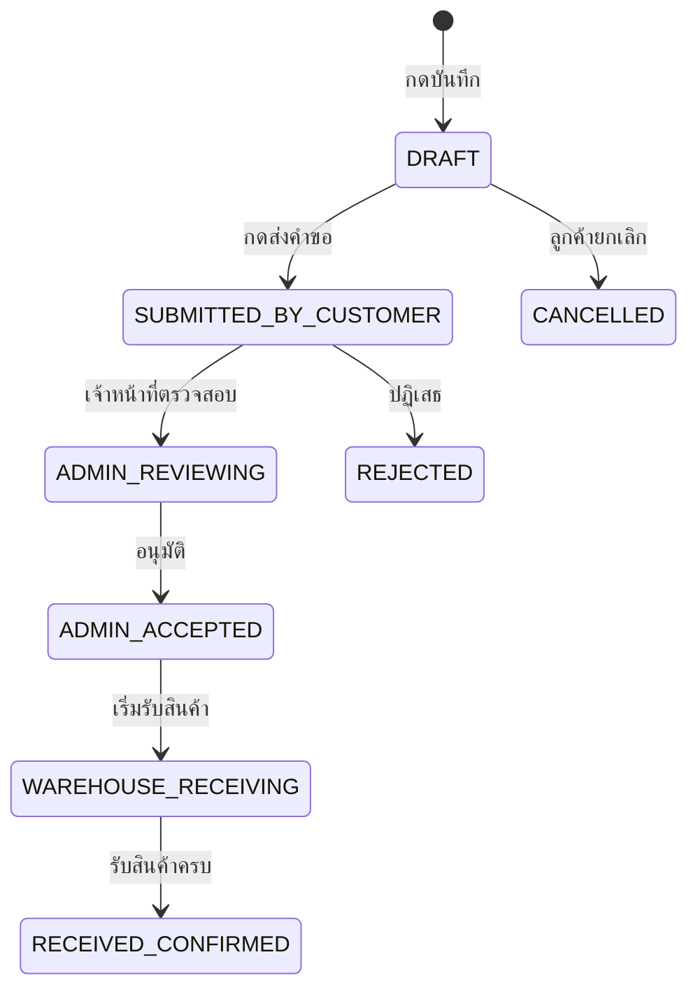

# แจ้งฝากสินค้า — สร้างคำขอใหม่ (Create Deposit Request)

## วัตถุประสงค์
หน้านี้ให้ลูกค้าสร้างคำขอฝากสินค้าก่อนนำสินค้ามาส่งที่คลัง โดยระบุข้อมูลสินค้า จำนวน วันที่คาดว่าจะมาถึง และข้อมูลผู้ติดต่อ

## ผู้ใช้งาน
- ลูกค้า (Customer User)
- ผู้ดูแลระบบ (Admin) — สร้างแทนลูกค้าได้

## สิทธิ์ที่ต้องการ
- **Customer User** ที่มีสิทธิ์เขียน (canWriteCustomerRequests)

## การเข้าถึง

| เมนู | เส้นทาง |
|------|---------|
| Customer Portal → แจ้งฝากสินค้า | สร้างคำขอฝากสินค้าแบบร่าง |
| URL | `/customer/deposit-request/new` |

---

## คำอธิบายฟอร์ม

### ส่วนที่ 1: ข้อมูลหัวเอกสาร (Header Information)

| ฟิลด์ | บังคับ | คำอธิบาย |
|-------|--------|---------|
| วันที่คาดว่าสินค้าจะมาถึง | ใช่ | วันที่วางแผนจะนำสินค้ามาส่ง |
| ชื่อผู้ติดต่อ | ใช่ | ชื่อคนขับหรือผู้นำสินค้ามาส่ง |
| เบอร์โทรศัพท์ | ใช่ | เบอร์ที่ติดต่อได้ |
| ทะเบียนรถ | ไม่ | ทะเบียนรถที่นำสินค้ามาส่ง |
| หมายเหตุ | ไม่ | ข้อมูลเพิ่มเติม เช่น ข้อกำหนดพิเศษ |

### ส่วนที่ 2: รายการสินค้า (Line Items)

สำหรับสินค้าแต่ละรายการ กรอก:

| คอลัมน์ | บังคับ | คำอธิบาย |
|---------|--------|---------|
| รหัสสินค้าลูกค้า | ไม่ | รหัสสินค้าของลูกค้าเอง |
| ชื่อสินค้า | ใช่ | ชื่อสินค้าที่นำมาฝาก |
| เลข LOT | ไม่ | หมายเลข LOT ของสินค้า |
| วันผลิต | ไม่ | วันที่ผลิต |
| วันหมดอายุ | ไม่ | วันหมดอายุ |
| จำนวนกล่อง | ใช่ | จำนวนกล่องที่ต้องการฝาก |
| น้ำหนัก (กก.) | ไม่ | น้ำหนักโดยประมาณ |
| UOM | ไม่ | หน่วยนับ |

---

## ขั้นตอนการสร้างคำขอฝาก

### ขั้นตอนที่ 1: เปิดหน้าสร้างคำขอ

ไปที่ **Customer Portal → แจ้งฝากสินค้า → สร้างคำขอฝากสินค้าแบบร่าง**

### ขั้นตอนที่ 2: กรอกข้อมูลหัวเอกสาร

1. เลือกวันที่คาดว่าสินค้าจะมาถึง (ปฏิทิน)
2. กรอกชื่อผู้ติดต่อและเบอร์โทร
3. กรอกทะเบียนรถ (ถ้ามี)
4. กรอกหมายเหตุ (ถ้ามี)

### ขั้นตอนที่ 3: เพิ่มรายการสินค้า

**วิธีที่ 1 — กรอกทีละรายการ:**
1. กรอกข้อมูลสินค้าในตาราง
2. กดปุ่ม **"+ เพิ่มรายการ"** เพื่อเพิ่มสินค้ารายการถัดไป

**วิธีที่ 2 — นำเข้า Excel:**
1. กดปุ่ม **"ดาวน์โหลด Template"** เพื่อรับไฟล์แม่แบบ
2. กรอกข้อมูลในไฟล์ Excel
3. กดปุ่ม **"นำเข้า Excel"** และเลือกไฟล์

**วิธีที่ 3 — คัดลอกจากคำขอเก่า:**
- เปิดคำขอเก่าในหน้า Deposit Request List
- กดปุ่ม **"คัดลอก (Copy)"** เพื่อสร้างคำขอใหม่จากข้อมูลเดิม

### ขั้นตอนที่ 4: บันทึกร่าง หรือ ส่งคำขอ

**บันทึกเป็นร่าง (DRAFT):**
- กดปุ่ม **"บันทึก"** เพื่อเก็บไว้แก้ไขภายหลัง
- ยังไม่ส่งให้เจ้าหน้าที่ดำเนินการ

**ส่งคำขอทันที:**
- กดปุ่ม **"ส่งคำขอ (Submit)"** เพื่อส่งให้เจ้าหน้าที่ตรวจสอบ
- สถานะเปลี่ยนเป็น SUBMITTED_BY_CUSTOMER

---

## ปุ่มทั้งหมด

| ปุ่ม | คำอธิบาย |
|------|---------|
| + เพิ่มรายการ | เพิ่มสินค้ารายการใหม่ |
| ลบรายการ (ถังขยะ) | ลบสินค้ารายการนั้น |
| ดาวน์โหลด Template | ดาวน์โหลดแม่แบบ Excel |
| นำเข้า Excel | นำข้อมูลจากไฟล์ Excel |
| ส่งออก Excel | ส่งออกรายการสินค้าเป็น Excel |
| บันทึก (Save) | บันทึกร่าง ยังไม่ส่ง |
| ส่งคำขอ (Submit) | ส่งคำขอให้เจ้าหน้าที่ตรวจสอบ |
| ยกเลิก (Cancel) | ยกเลิกและกลับไปรายการ |

---

## การตรวจสอบ (Validation)

| ฟิลด์ | ข้อความแจ้งเตือน |
|-------|----------------|
| วันที่มาถึง ว่าง | "กรุณาระบุวันที่คาดว่าจะมาถึง" |
| ชื่อผู้ติดต่อ ว่าง | "กรุณาระบุชื่อผู้ติดต่อ" |
| ไม่มีรายการสินค้า | "กรุณาเพิ่มรายการสินค้าอย่างน้อย 1 รายการ" |
| ชื่อสินค้าว่าง | "กรุณาระบุชื่อสินค้า" |
| จำนวนกล่องว่าง | "กรุณาระบุจำนวนกล่อง" |

---

## สถานะของคำขอฝาก

---

## กฎทางธุรกิจ

1. สร้างคำขอได้หลายคำขอพร้อมกัน
2. คำขอที่เป็น DRAFT สามารถแก้ไขได้ตลอดเวลา
3. เมื่อส่งแล้ว (SUBMITTED) จะแก้ไขตัวหัวเอกสารได้บางส่วน
4. ไม่สามารถส่งคำขอที่ไม่มีรายการสินค้า
5. ขนาดไฟล์แนบสูงสุด 10 MB ต่อไฟล์

---

## คำถามที่พบบ่อย

**ถาม:** ส่งคำขอไปแล้ว แต่ต้องการแก้ไขได้ไหม?
**ตอบ:** ได้บางส่วน — ติดต่อเจ้าหน้าที่คลัง หรือยกเลิกแล้วสร้างใหม่

**ถาม:** จะดูคำขอที่ส่งไปแล้วได้ที่ไหน?
**ตอบ:** ไปที่ Customer Portal → แจ้งฝากสินค้า → รายการคำขอ หรือ "ประวัติคำขอ"

**ถาม:** นำเข้า Excel แล้วข้อมูลหายไป ทำอย่างไร?
**ตอบ:** ตรวจสอบว่าใช้ Template ที่ดาวน์โหลดจากระบบ และข้อมูลอยู่ในคอลัมน์ที่ถูกต้อง

---

## แนวปฏิบัติที่ดี

- สร้างคำขอล่วงหน้าอย่างน้อย 1-2 วันก่อนสินค้าถึง
- กรอก LOT Number และวันหมดอายุเสมอ เพื่อความถูกต้องของรายงาน
- ตรวจสอบข้อมูลก่อนกดส่งคำขอ
