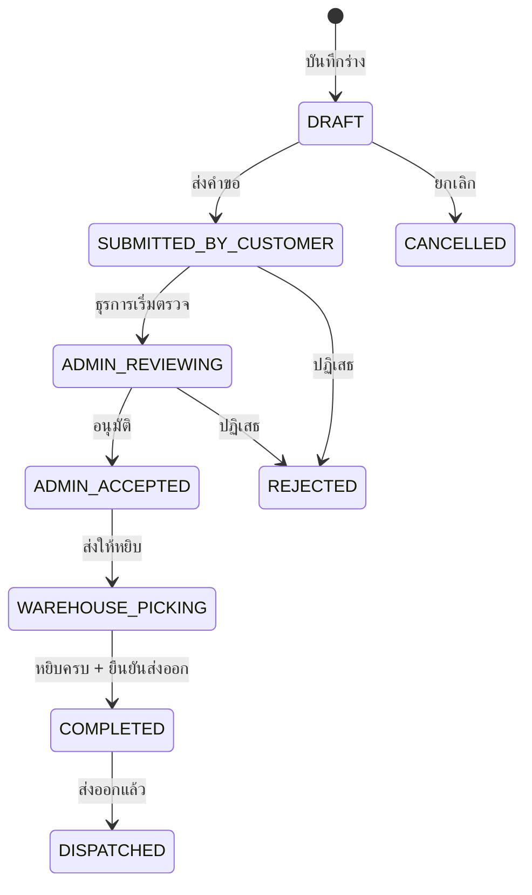

# แจ้งเบิกสินค้า — สร้างคำขอใหม่ (Create Withdrawal Request)

## วัตถุประสงค์
หน้านี้ให้ลูกค้าสร้างคำขอเบิกสินค้าออกจากคลัง โดยระบุสินค้าที่ต้องการ จำนวน วันที่ต้องการ และรูปแบบการส่ง

## ผู้ใช้งาน
- ลูกค้า (Customer User)
- ผู้ดูแลระบบ (Admin) — สร้างแทนลูกค้าได้

## สิทธิ์ที่ต้องการ
- **Customer User** ที่มีสิทธิ์เขียน

## การเข้าถึง

| เมนู | เส้นทาง |
|------|---------|
| Customer Portal | แจ้งเบิกสินค้า → สร้างคำขอเบิกแบบร่าง |
| URL | `/customer/withdrawal-request/new` |

---

## คำอธิบายฟอร์ม

### ส่วนที่ 1: ข้อมูลหัวเอกสาร

| ฟิลด์ | บังคับ | คำอธิบาย |
|-------|--------|---------|
| วันที่ต้องการส่งออก | ใช่ | วันที่ต้องการให้สินค้าออกจากคลัง |
| ประเภทการส่ง | ใช่ | PICKUP (มารับเอง) หรือ DELIVERY (ส่งถึงที่) |
| ผู้ติดต่อรับสินค้า | ไม่ | ชื่อผู้ที่จะมารับหรือรับสินค้า |
| ปลายทาง | ไม่ | ที่อยู่ส่งสินค้า (กรณี DELIVERY) |
| หมายเหตุ | ไม่ | ข้อมูลเพิ่มเติม |

**ประเภทการส่ง:**
- **PICKUP (รับเอง):** ลูกค้าส่งรถมารับสินค้าที่คลัง
- **DELIVERY (ส่งถึงที่):** คลังจัดส่งให้ถึงปลายทาง

### ส่วนที่ 2: รายการสินค้าที่ต้องการเบิก

| คอลัมน์ | บังคับ | คำอธิบาย |
|---------|--------|---------|
| รหัสสินค้า / ชื่อสินค้า | ใช่ | เลือกจาก Catalog หรือพิมพ์ |
| LOT No | ไม่ | ระบุ LOT ที่ต้องการ (ถ้าต้องการเฉพาะ) |
| จำนวนกล่องที่ขอ | ใช่ | จำนวนกล่องที่ต้องการ |
| น้ำหนักที่ขอ (กก.) | ไม่ | น้ำหนักโดยประมาณ |
| กฎการหยิบ (Picking Rule) | ไม่ | FEFO (First Expired First Out) |

---

## ขั้นตอนการสร้างคำขอเบิก

**ขั้นตอนที่ 1:** ไปที่ **Customer Portal → แจ้งเบิกสินค้า → สร้างคำขอเบิกแบบร่าง**

**ขั้นตอนที่ 2:** เลือกวันที่ต้องการส่งออก

**ขั้นตอนที่ 3:** เลือกประเภทการส่ง (PICKUP / DELIVERY)
- หาก DELIVERY: กรอกที่อยู่ปลายทาง

**ขั้นตอนที่ 4:** เพิ่มรายการสินค้าที่ต้องการเบิก:
- เลือกสินค้าจาก Catalog ของลูกค้า
- กรอกจำนวนกล่อง
- ระบุ LOT ถ้าต้องการเบิกเฉพาะ LOT

**ขั้นตอนที่ 5:** กด **"บันทึก"** เพื่อเก็บเป็นร่าง หรือ **"ส่งคำขอ"** เพื่อส่งทันที

---

## ปุ่มทั้งหมด

| ปุ่ม | คำอธิบาย |
|------|---------|
| + เพิ่มรายการสินค้า | เพิ่มสินค้ารายการใหม่ |
| ลบรายการ | ลบสินค้ารายการนั้น |
| บันทึก (Save) | บันทึกเป็นร่าง |
| ส่งคำขอ (Submit) | ส่งให้เจ้าหน้าที่ตรวจสอบ |
| ยกเลิก | ออกโดยไม่บันทึก |

---

## สถานะของคำขอเบิก

---

## การตรวจสอบ (Validation)

| ฟิลด์ | ข้อความแจ้งเตือน |
|-------|----------------|
| วันที่ส่งออกว่าง | "กรุณาระบุวันที่ต้องการส่งออก" |
| ประเภทการส่งว่าง | "กรุณาเลือกประเภทการส่ง" |
| ไม่มีรายการสินค้า | "กรุณาเพิ่มรายการสินค้าอย่างน้อย 1 รายการ" |
| จำนวนกล่องว่าง | "กรุณาระบุจำนวนกล่อง" |

---

## กฎทางธุรกิจ

1. ไม่สามารถเบิกมากกว่ายอดคงเหลือที่มีในคลัง
2. ถ้าไม่ระบุ LOT ระบบใช้กฎ FEFO (หมดอายุก่อน ออกก่อน) โดยอัตโนมัติ
3. สร้างคำขอล่วงหน้าอย่างน้อย 1 วันทำการเพื่อให้เจ้าหน้าที่เตรียมสินค้าได้

---

## คำถามที่พบบ่อย

**ถาม:** สินค้าที่ต้องการไม่ปรากฏในรายการ ทำอย่างไร?
**ตอบ:** ตรวจสอบยอดคงเหลือในหน้า "ยอดคงเหลือลูกค้า" ก่อน หากมียอดแต่ไม่ขึ้น ติดต่อเจ้าหน้าที่

**ถาม:** จะคัดลอกคำขอเก่ามาสร้างใหม่ได้ไหม?
**ตอบ:** ได้ ไปที่รายการคำขอเบิก กดปุ่ม "คัดลอก" ที่คำขอเดิม

---

## แนวปฏิบัติที่ดี

- ตรวจสอบยอดคงเหลือก่อนสร้างคำขอ
- ระบุ LOT หากต้องการสินค้าล็อตเฉพาะ
- สร้างคำขอล่วงหน้า 1-2 วันเพื่อให้คลังเตรียมพร้อม
