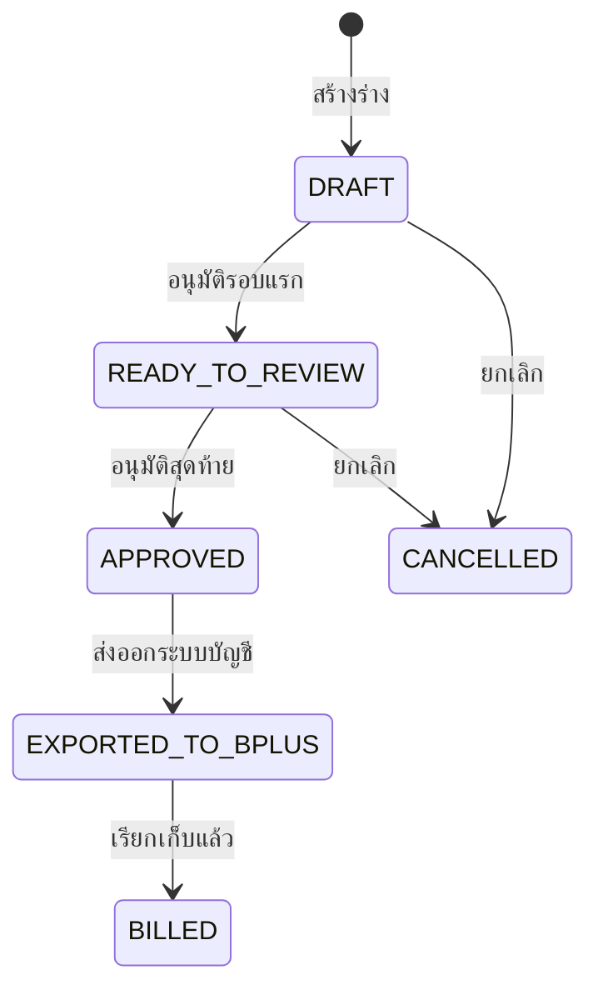

# รายละเอียดใบแจ้งหนี้ร่าง (Invoice Draft Detail)

## วัตถุประสงค์
หน้านี้แสดงรายละเอียดครบถ้วนของใบแจ้งหนี้ร่างแต่ละฉบับ ให้เจ้าหน้าที่บัญชีตรวจสอบและอนุมัติหรือยกเลิก

## ผู้ใช้งาน
- Accounting
- Admin

## สิทธิ์ที่ต้องการ
- **Accounting** หรือ **Admin**

## การเข้าถึง

| เมนู | เส้นทาง |
|------|---------|
| Billing → ใบแจ้งหนี้ร่าง | คลิกเลขที่ร่าง |
| URL | `/billing/invoice-drafts/:draftId` |

---

## คำอธิบายหน้าจอ

### ส่วนที่ 1: สรุปข้อมูลหัวบิล

| ข้อมูล | ความหมาย |
|--------|---------|
| เลขที่ร่าง | รหัสเฉพาะ |
| ลูกค้า | ลูกค้าที่ออกบิล |
| สถานะ | Badge สีปัจจุบัน |
| งวด | วันเริ่มต้น ถึง วันสิ้นสุด |
| จำนวนรวม | ปริมาณรวม |
| น้ำหนักที่คิดได้ | น้ำหนักรวม |
| ยอดรวม | มูลค่า + สกุลเงิน |
| วันที่สร้าง | วันที่ออกร่าง |
| หมายเหตุ | ข้อมูลเพิ่มเติม |
| เลขอ้างอิงภายใน | รหัสอ้างอิงภายใน |

**กรณียกเลิก:**
- วันที่ยกเลิก
- เหตุผลการยกเลิก

### ส่วนที่ 2: ตารางรายการ (Draft Lines)

| คอลัมน์ | ความหมาย |
|---------|---------|
| เคลื่อนไหวต้นทาง | รหัสรายการเคลื่อนไหว |
| เอกสารต้นทาง | เลขที่เอกสารอ้างอิง |
| สินค้า | รหัส - ชื่อสินค้า |
| ประเภทเคลื่อนไหว | INBOUND / OUTBOUND / STORAGE |
| วันที่ | วันที่เกิดรายการ |
| จำนวน + หน่วย | ปริมาณ |
| น้ำหนักที่คิดได้ | น้ำหนักสำหรับคำนวณ |
| สถานะการเรียกเก็บ | สถานะรายการ |

---

## สถานะและการดำเนินการ

---

## ปุ่มดำเนินการ

| ปุ่ม | เงื่อนไข | คำอธิบาย |
|------|---------|---------|
| กลับรายการ | เสมอ | กลับหน้า Invoice Draft List |
| Approve Draft | READY_TO_REVIEW | อนุมัติใบแจ้งหนี้ (ต้องยืนยัน) |
| Cancel Draft | DRAFT, READY_TO_REVIEW | ยกเลิก (ต้องระบุเหตุผล) |
| Print Invoice | เสมอ | เปิดหน้าพิมพ์ใบแจ้งหนี้ |

---

## ขั้นตอนการอนุมัติใบแจ้งหนี้

**ขั้นตอนที่ 1:** ตรวจสอบรายการในตาราง Draft Lines ว่าครบถ้วน

**ขั้นตอนที่ 2:** ตรวจสอบยอดรวมและงวดที่ถูกต้อง

**ขั้นตอนที่ 3:** กด **Approve Draft**

**ขั้นตอนที่ 4:** ยืนยันในกล่องยืนยัน

**ขั้นตอนที่ 5:** ระบบเปลี่ยนสถานะเป็น APPROVED และแสดงข้อความสำเร็จ

---

## ขั้นตอนการยกเลิก

**ขั้นตอนที่ 1:** กด **Cancel Draft**

**ขั้นตอนที่ 2:** กรอก **เหตุผลการยกเลิก**

**ขั้นตอนที่ 3:** กด **ยืนยันยกเลิก**

**ขั้นตอนที่ 4:** ระบบบันทึกวันที่และเหตุผลการยกเลิก

---

## กฎทางธุรกิจ

1. APPROVED ไม่สามารถยกเลิกได้ — ต้องติดต่อผู้ดูแลระบบ
2. CANCELLED เป็นสถานะสุดท้าย ไม่สามารถเปิดใหม่ได้
3. เหตุผลการยกเลิกบันทึกถาวรพร้อมวันเวลา

---

## คำถามที่พบบ่อย

**ถาม:** อนุมัติไปแล้ว พบข้อผิดพลาด ทำอย่างไร?
**ตอบ:** ติดต่อ Admin เพื่อดำเนินการตามขั้นตอนแก้ไข — ไม่สามารถยกเลิกเองหลัง APPROVED

**ถาม:** Print Invoice พิมพ์เอกสารออกมาในรูปแบบใด?
**ตอบ:** เปิดหน้าพิมพ์ในเบราว์เซอร์ สามารถพิมพ์หรือบันทึกเป็น PDF
